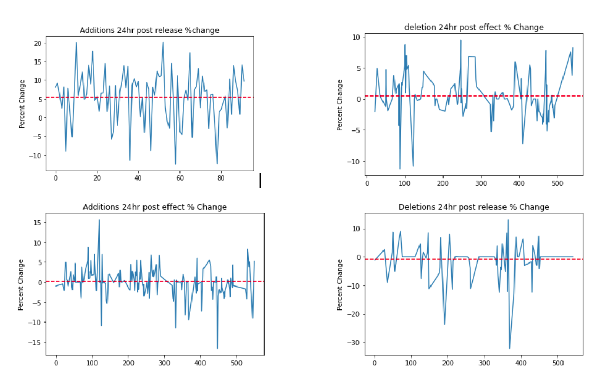
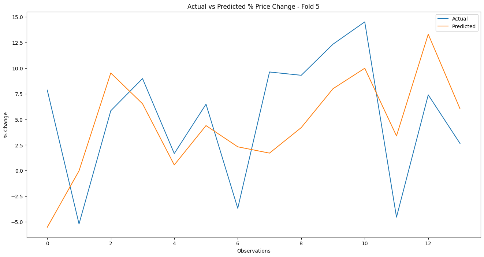

# Index-Rebalancing
Personal project (then used as final project for Machine Learning for Engineers course UMass Amherst Spring 2023). Focused on index rebalancing trading strategy

# Abstract
This project combines our knowledge of mathematics, economics, and computer engineering to develop a comprehensive study exploring the predictive power of machine learning in the context of index rebalancing and its subsequent impact on stock prices. Drawing inspiration from our shared fascination with quantitative finance, we sought to construct a robust trading strategy and assess its profitability. Building upon existing research and literature, we embarked on collecting and preprocessing extensive datasets. Through the application of linear regression, we derived an equation that assigned weights to individual input variables based on their efficacy in forecasting price effects. Our findings shed light on the potential for machine learning techniques to enhance understanding and decision-making in the realm of financial markets, presenting a promising avenue for further exploration and refinement of predictive models.

# Introduction
Accurately predicting stock price changes is a challenging task due to the complex nature of the stock market, influenced by various factors. One crucial factor that significantly affects stock prices is the process of index rebalancing, which involves adjusting index composition to reflect market changes. In this research, we focus on stocks added to Standard & Poor's (S&P) indexes during rebalancing. Our objective is to gather data on these stocks and develop a robust forecasting framework to estimate the percentage change in stock values following index rebalancing. By leveraging machine learning or deep learning models, we aim to forecast stock price changes 24 hours after the announcement of index addition and 24 hours after the inclusion becomes effective.
The input to our model consists of stocks being added or removed from the index, along with performance variables such as company performance, sector performance, and index performance during three distinct periods preceding the rebalance list release. We employ linear regression as our chosen method to generate stock price predictions. Linear regression offers simplicity, interpretability, and computational efficiency, making it well-suited for stock price prediction tasks with limited data. Additionally, it mitigates the risk of overfitting, which is often encountered with neural networks. While neural networks excel in large and complex datasets with nonlinear relationships, our dataset is relatively small and straightforward, leading us to opt for linear regression. Similarly, we forego support vector machines (SVMs) since linear regression models demonstrate superior performance in stock price prediction tasks, requiring less sensitivity to kernel function and hyperparameter selection.
This study seeks to enhance understanding and decision-making in financial markets through the exploration of index rebalancing and the application of machine learning techniques. We will present our methodology, results, and implications in the subsequent sections, along with an explanation of how different components of the project were utilized across various courses.

# Related work
The prediction of future stock price movements has garnered significant attention among researchers in the field. Our exploration of existing literature encompassed reports by both computer scientists and stock market analysts, providing valuable insights into the intersection of machine learning and financial markets. Notably, Escobar et al. (2021) reported a 5.5% price change for stocks added to the S&P 500 index, sparking our interest in index rebalancing.
We also examined the work of engineers developing machine learning models for stock price prediction. Guo (2022) utilized transaction data from the S&P 500 index, consisting of 5,000 observations. Some researchers successfully employed hybrid neural network models, including Mehtab and Sen (2019) who used various regression models to predict closing prices.
The National Bureau of Economic Research investigated regression discontinuity and its impact on stock price indexing. Chang et al. (2013) found that this approach offers a novel means of measuring the effects on stock features.
Regarding the state-of-the-art approaches, hybrid neural networks have emerged as prominent methods for stock price prediction. However, interpreting their decision-making processes presents challenges compared to linear regression models, emphasizing the need for a balance between interpretability and accuracy. Regarding quantitative trading, the most successful algorithmic trader in history is Jim Simons. Since 1988, his flagship Medallion fund has generated average annual returns of 66%, racking up trading gains of more than $100 billion. No one in the investment world comes close. Warren Buffett, George Soros, Peter Lynch, Steve Cohen, and Ray Dalio all fall short. We believe that this ROI of 66% can be considered the state-of-the-art in terms of annual returns.
In conclusion, the reviewed literature provides valuable insights into machine learning techniques and stock market dynamics. Studies by Escobar et al. (2021), Guo (2022), Mehtab and Sen (2019), and Chang et al. (2013) offer diverse methodologies and approaches. Hybrid neural networks currently dominate the field, although interpretability remains a consideration.

# Dataset and Features
In this study, we created a dataset by collecting publicly available information from YAHOO Finance. The dataset focused on stocks that were added to various indices of the S&P, including the S&P 500, S&P SmallCap 600, and S&P MidCap 400. The data covered the period from May 2021 to January 2023 and consisted of 93 data samples. To ensure data quality, we performed an 80-20 split to divide the dataset into training and test data. The original dataset was larger, with over 500 data samples, but it was narrowed down to stocks added to the specified S&P indices, and stocks with missing data were removed. Additionally, due to API limitations, we had to further trim down our dataset.
To preprocess the data, we developed a PDF reader that utilized Tabula in Python. This reader extracted the necessary information from the rebalance list PDFs obtained from the S&P global website (Example of a rebalance list). We then used the Yahoo Finance (YFinance) API to augment the dataset with stock-specific information such as price, volume, industry, and sector.
The dataset consisted of the following features:
Stocks being added or removed from the index
Performance variables, including company performance, sector performance, and index performance, during three distinct periods preceding the release of the rebalance list
Total market capitalization of the index
2-week average volume traded for each stock
Sum of dividends paid out by the stock over the previous 10 weeks
sector, index, and company performance over previous 1 week, 5 weeks, and 20 weeks

The time-series data (sector, index, and company performance) in the dataset was discretized into three different periods: 1 week, 5 weeks, and 20 weeks. This discretization allowed us to capture different time horizons and analyze their impact on stock price changes.

# Methodology

Linear Regression is a widely used algorithm for predicting continuous numeric values. It assumes a linear relationship between the input features and the target variable. The algorithm fits a linear equation to the training data by minimizing the sum of squared differences between the predicted and actual values. The equation is represented as follows:
y = β0 + β1x1 + β2x2 + ... + βnxn
where y is the target variable, x1, x2, ..., xn are the input features, and β0, β1, β2, ..., βn are the coefficients to be learned.
In our analysis, we implemented these algorithms using the scikit-learn library in Python. We tuned the hyperparameters of each algorithm using cross-validation to find the best configuration for prediction accuracy. We split the dataset into training and test sets and evaluated the performance of each algorithm based on various metrics such as mean squared error (MSE), mean absolute error (MAE), and coefficient of determination (R-squared).
LSTM networks are particularly effective in capturing dependencies and patterns in time series data, making them well-suited for analyzing stock market data, which often exhibits temporal dependencies. Unlike traditional feedforward neural networks, LSTM networks have a memory component that allows them to retain information over longer sequences. The key components of an LSTM network are memory cells and gates. The memory cells store and update information over time, while the gates regulate the flow of information through the network. The gates, namely the input gate, forget gate, and output gate, control the information flow into and out of the memory cells.
To ensure fair learning from all features and prevent any single feature from dominating the learning process, we normalized the data using the MinMaxScaler from Scikit-learn. This scaling technique transformed the data to a common range between 0 and 1, promoting balanced learning from all features.
To fine tune the parameters of our LSTM model we utilized the grid search method to find the parameters that presented the best results. We utilized the GridSearchCV function from scikit-learn library, which automates the grid search, while also performing cross-validation during the evaluation. A grid search involves defining a grid of hyperparameters and evaluating the model’s performance for each point in the grid. The grid search evaluates the model’s performance for each combination of hyperparameters on the grid. The parameters we utilized in our grid search included the number of neurons in the LSTM layer, the optimizer type to be used in training, batch size, and the number of training epochs. Each of these parameters can influence the model’s learning process and its performance on unseen data. For example, the number of neurons controls the capacity of the model to catch patterns in the data. The optimizer influences how the model controls its interior parameters to lower the training error. The batch size limits the amount of data the model sees at one time and the epochs defines the amount of times the model iterates over the dataset. 

# Experiments/Results/Discussion

Investors pay very close attention to these rebalances as many believe that there is profit to be made. The basic trading strategy behind rebalancing is as follows: buy the stocks being added and short the stocks being removed. The idea behind this strategy is since hedge funds and other large trading groups often follow the patterns of the S&P and other indexes, when the S&P adds a stock to their index the hedge funds will also buy that stock in large quantities, likely driving the price up. And when the S&P removes a stock, the hedge funds will sell the stock, likely driving the price down. This leads us to divide our data into two groups, stocks being added and stocks being deleted. There are also two dates we thought to be relevant, the data that the rebalance list was released and the date that the changes went into effect. With that in mind, we decided to split up our data even further, ending up with 4 groups. Added stocks and their price difference 24 hours after the list was released, added stocks and their price difference 24 hours after the list went into effect, deleted stocks and their price difference 24 hours after the list was released, and deleted stocks and their price difference 24 hours after the list went into effect.
Our first step once we had a clean and processed dataset was to do some basic analysis to see if there were any significant results from the four groups. We compared the average ROI during the 24 hour periods in the four groups. Here are the results we got:

As you can see, none of the groups had any significant results, except for that stocks being added which went up over 5% during the 24 hour period after the rebalance list was released.
After seeing these results, we decided to shift our focus solely on the stocks being added into indexes and their results during the 24 hours after the lists were released. Our main goal is to be able to predict which stocks will be affected the greatest and potentially use this as a profitable trading strategy.
Our first model was a linear regression model from the sklearn library using a 80-20 training-test data split. The input variables were the sector, index, and company performance leading up to the release for 3 different lengths of time, 1 week, 5 weeks, and 20 weeks. We also included the total market cap of the index as well as the 2 week volume average and the sum of dividends paid out by the stock over the previous 10 weeks. The model was trained for 1000 epochs but the average clf score was -0.1, which is far from perfect. However, we were able to get some valuable information when we outputted the coefficients of the linear regression equation to see which variables had the biggest impact on the desired result. According to the coefficients, the 20-week performance variables were far less important than the 1-week and 5-week variables. Additionally, the 2 week average volume traded of each stock didn’t have much of an impact, but whether or not the stock paid out dividends did. We still wanted to know if this linear model would have been able to be profitable with any adjustments, so what we did was select only the stocks where the predicted output was above a certain amount. We played around with this to see at what threshold was the most profitable and our answer was 7%. When we only selected the stocks that the linear regression model predicted a change of 7% or more, the actual average change was 8.24%

| Actual change | Predicted change |
|--------------:|-----------------:|
|      8.139869 |        7.252531 |
|      6.788077 |        8.755144 |
|     20.017240 |        8.771344 |
|      5.838512 |        8.278123 |
|     13.982063 |        7.147442 |
|     14.456949 |        8.085960 |
|      8.574881 |        8.280803 |
|      9.626756 |        8.463116 |
|      0.129809 |        8.061031 |
|     -3.988344 |        8.188798 |
|      7.583768 |        7.124308 |
|      5.870947 |        8.966869 |
|     12.333095 |        7.076790 |
|     11.145196 |        9.175817 |
|     20.074626 |        7.959058 |
|     14.506850 |        8.513511 |
|      3.864210 |        7.944864 |
|     11.216861 |        8.817162 |
|     17.317569 |        9.026893 |
|      7.387385 |       11.510598 |
|      8.369286 |        8.518804 |
|     13.048085 |        8.883695 |
|      2.650797 |        8.137456 |
|     11.066149 |        9.716412 |
|      6.897417 |       10.332827 |
|     -3.012613 |        8.042343 |
|      6.066175 |        7.767262 |
|     -1.764384 |        8.110319 |
|      1.555865 |        7.585922 |
|     10.234158 |        9.394775 |
|      0.833764 |        8.469924 |
|     13.903845 |        8.153528 |
|      7.182159 |        7.932592 |

After experimenting with linear regression models, we then decided to implement a Long Short-Term Memory network. Similar to the linear regression model, we used the same variety of features related to sector performance, index performance, and company performance during three distinct periods preceding the rebalance list release. The target variable or output used for the LSTM model is the price percentage change twenty four hours after the list release. We split the dataset into training and test sets, 80% training and 20% testing. Next, we normalized the data using MinMaxScaler from Scikit-learn so that no single feature dominates over the other features, promoting fair learning from all of the features.
	The model we created consisted of an input LSTM layer with 64 units, two dense layers with each 32 units and Rectified Linear Unit activation (ReLU), and it ended with a single unit output layer for predicting the price percentage change twenty four hours after the rebalance list was released. We compiled the model with the Mean Squared Error loss function and Adam optimizer. The model was trained for 200 epochs with a batch size of 36, but it underfit the data. The mean absolute error was 0.194 and the predicted price change was 7.15%. To better fit the model we utilized 5-fold cross-validation to split the data into subsets, and then train and evaluate it five times, each time with a different subset as the validation set. The graph below shows the performance on the 5th fold of the cross-validation.

The graph shows the actual price change vs the predicted price change twenty four hours after the release of the rebalance list. As you can see the model’s predictions show a degree of conformity with the actual changes, and the model had only a mean absolute error of 0.132. This is a significant improvement compared to the previous model, although the model doesn’t perfectly capture all the fluctuations it follows the general trend of the actual price changes. This is to be expected, given the complex nature of the factors that drive stock prices, nevertheless the mse of 0.132, while not insignificant, is relatively low. This shows that on average our model predicted values that were fairly close to the actual values. 

# Conclusion and Future work

The experiment/research is far from perfect and there are many things that we wish we could have done differently, but certain factors limited us. Firstly, the api we used to get the price and other information of the stock, YahooFinance, only allowed us to get information within the past 2 years. This greatly limited us as we had collected data going back to 2015. In addition, the API isn’t very well maintained to begin with as it often wasn’t able to get information on certain stocks. In the end, our dataset only included 93 stocks, but we had collected information on over 500 stocks. We believe that this greatly reduced the accuracy of our model as if we had a larger dataset, we likely could have gotten a more accurate model.
Despite these limitations, we were able to create an LSTM model that showed promising potential. Comparing the linear regression model and the LSTM models we created, we found the highest performing model to be the LSTM model that incorporated 5-fold cross-validation. We believe that this model performed the best because, unlike linear regression models, LSTM models can remember long-term dependencies in time series data, which is key in stock price movements. This specific LSTM model was able to collect better results due to the 5-fold cross-validation, which helped the model to reduce the risk of overfitting and provide a better understanding of how the model will perform on unseen data. Understanding the model’s performance is especially important in stock market predictions, where the model’s ability to perform well across various market conditions is crucial. The analysis of these results offers insights into ways to improve the model in future trials. Along with gathering more data,  we could investigate the possibility of adding extra features to the model such as company fundamentals, economies indicators, or even industry specific indicators. 

# References

Sidra, M., & Jaydip, S. (2019). A Robust Predictive Model for Stock Price Prediction 
Using Deep Learning and Natural Language Processing. 
10.36227/techrxiv.15023361.v1

Li, Y., & P, Y. (2020). A Novel Ensemble Deep Learning Model for Stock 
Prediction Based on Stock Prices and News. 10.48550/arXiv.2007.12620

Dong, S., Wang, J., Luo, H., Wang, H., Wu, F. (2021). A dynamic predictor selection 
algorithm for predicting stock market movement. Expert Systems with 
Applications, 186. 10.1016/j.eswa.2021.115836

Kanwal, A., Lau, M., Ng, S., Sim, K., Chandrasekaran, S. (2022). 
BiCuDNNLSTM-1dCNN — A hybrid deep learning-based predictive model for
stock price prediction. Expert Systems with Applications, 202. 
10.1016/j.eswa.2022.117123

Guo, Y. (2022). Stock Price Prediction Using Machine Learning. Soderton University 
Dissertation. http://sh.diva-portal.org/smash/get/diva2:1672304/FULLTEXT01.pdf

Escobar, M., Pandolfi, L., Pedraza, A., Williams, T. (2021). The Anatomy of Index 
Rebalancings: Evidence from Transaction Data. World Bank Group Policy 
Research Working Paper. The-Anatomy-of-Index-Rebalancings-Dec-22-2021.pdf

Chang, Y., Hong, H., Liskovich, I. (2013). Regression Discontinuity and the Price Effects 
of Stock Market Indexing. National Bureau of Economic Research. 
http://www.nber.org/papers/w19290

